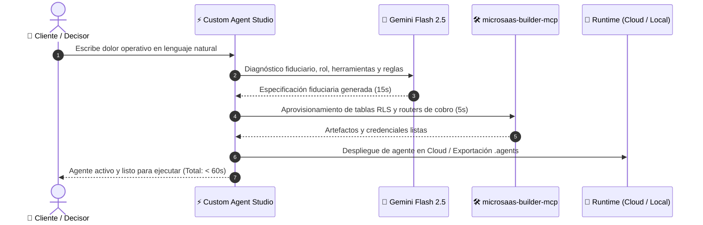

# Arquitectura de Ejecución, Ciclo de Vida y Despliegue del Agente

> Documento técnico que responde: ¿En qué momento se entrega el agente? ¿Dónde vive? y ¿Cómo realiza la automatización del proceso solicitado con cero intervención humana?

---

## ⚡ 1. ¿En Qué Momento se Entrega el Agente?

El agente se entrega **listo para operar en menos de 60 segundos** desde el momento en que el cliente escribe su dolor no resuelto:

---

## 🌐 2. ¿Dónde Vive el Agente? (Arquitectura Dual Fiduciaria)

El cliente no queda atado a un único entorno cerrado; el agente tiene dos formas soberanas de existencia:

### Opción A: Runtime Cloud 24/7 (Desatendido en la Nube)
* **Dónde reside:** En la infraestructura serverless de la plataforma (Vercel / Node.js + base de datos PostgreSQL en Supabase con aislamiento estricto por tenant mediante Row Level Security - RLS).
* **Cómo opera:**
  - El cliente **no necesita tener su computadora encendida ni ninguna pestaña del navegador abierta**.
  - El agente está escuchando webhooks continuamente (WhatsApp Business API, Stripe, Wompi, Gmail/Resend, n8n).
  - Al recibir un evento (por ejemplo, un nuevo mensaje de WhatsApp de un cliente molesto o una factura no pagada), el agente despierta en milisegundos con Gemini Flash 2.5, evalúa las reglas fiduciarias, invoca las herramientas autorizadas y ejecuta la acción en producción real.
  - Guarda la bitácora fiduciaria en la base de datos y despacha el reporte al correo del responsable.

### Opción B: Runtime Local Soberano (Google Antigravity / Cursor)
* **Dónde reside:** En la carpeta `.agents/` del proyecto o computadora del cliente.
* **Cómo opera:**
  - El cliente descarga el paquete `.zip` con un solo clic.
  - Al abrir su espacio de trabajo en Google Antigravity o Cursor, el agente es reconocido automáticamente a través de sus archivos `.md` y `mcp_config.json`.
  - Puede ejecutar scripts locales, consultar archivos confidenciales en disco y operar con sus propias claves de API sin compartir información con terceros.

---

## 🔄 3. ¿Cómo se Realiza la Automatización del Proceso Paso a Paso?

Para garantizar **cero intervención humana**, el agente se rige por un bucle determinista de 4 etapas:

1. **Recepción del Evento Disparador (Trigger):**  
   Llega una señal externa verificada (correo de un lead, alerta de stock bajo, transferencia bancaria o mensaje de soporte).
2. **Evaluación Fiduciaria (Inference):**  
   Gemini Flash 2.5 analiza los datos contra las reglas inmutables:
   - ¿El cliente es real? (Verificación MX).
   - ¿Cumple con los límites de seguridad? (Rate-limiting y permisos RLS).
   - ¿Requiere autorización humana? (Si es una eliminación o reembolso mayor a \$500 USD, pausa y pide confirmación; si es una operación operativa estándar, continúa de forma autónoma).
3. **Ejecución de Herramientas MCP (Execution):**  
   Invoca la herramienta precisa (`configure_payment_gateway`, `whatsapp_dispatcher`, `reconcile_invoice`). Cero simulaciones ni mocks.
4. **Notificación Ejecutiva Sintética (Reporting):**  
   Emite la confirmación aplicando la regla de síntesis al 50% con enlace de comprobante fiduciario y registra el identificador inmutable en la bitácora.
