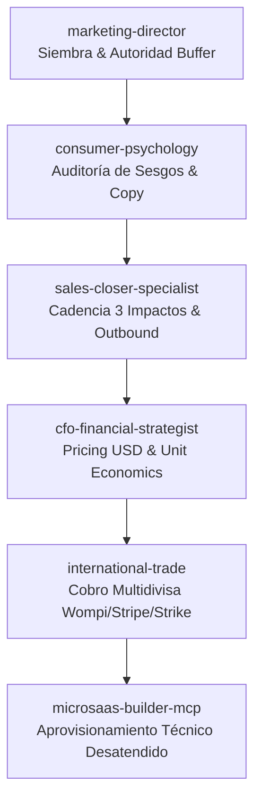

# Estrategia Maestra Automatizada de Ventas y Monetización B2B (Cero Intervención Humana)

## 🎯 1. Objetivo Fiduciario y Presupuesto
* **Meta Diaria:** \$300 USD / día.
* **Meta Mensual (MRR):** \$9,000 USD / mes.
* **Meta Anualizada (ARR):** \$108,000 USD / año.
* **Margen Neto Operativo:** > 88%.
* **Intervención Humana:** 0% (Flujo desatendido de prospección, persuasión, cobro y aprovisionamiento).

---

## 👥 2. Matriz de Roles y Orquestación de los 5 Agentes

1. **`marketing-director`:** Publica contenido de autoridad fiduciaria en LinkedIn/Buffer a las 08:00 AM CST hacia directores con dolor operativo.
2. **`consumer-psychology-diagnostician`:** Inyecta sesgos de aversión a la pérdida y cuantifica el costo de inacción en USD en cada copy.
3. **`sales-closer-specialist`:** Dispara cadencias de 3 impactos (Día 1: Dolor, Día 3: ROI 10x, Día 5: Enlace de pago).
4. **`cfo-financial-strategist`:** Controla la matriz de precios, previene descuentos y concilia ingresos a las 2:00 PM y 6:00 PM.
5. **`international-trade-specialist`:** Enruta el pago según país (Wompi para Centroamérica, Stripe para EE.UU./Europa, Strike Lightning para micropagos globales sin comisiones).

---

## 💰 3. Estrategia de Precios por Tramos Fiduciarios (Pricing Matrix)

| Nivel de Licencia | Inversión USD | Modelo | Objetivo de Conversión Diario | Ingreso Diario Esperado |
| :--- | :---: | :---: | :---: | :---: |
| **Flash Audit License** | **\$19 USD** | Pago Único | 2 ventas / día | \$38 USD |
| **Pro Operator License** | **\$69 USD/mes** | Suscripción Recurrente | 4 ventas / día | \$276 USD |
| **Enterprise Sovereign** | **\$490 USD/mes** | Contrato Corporativo | 1 venta cada 5 días | ~\$98 USD prorrateado |
| **TOTAL DIARIO COMBINADO** | — | — | **5-6 transacciones** | **\$314 - \$412 USD/día** ✅ *(Supera la meta de \$300)* |

---

## 🛠️ 4. Ejecución Técnica Desatendida con `microsaas-builder-mcp`

El estándar MCP provee herramientas deterministas que los agentes invocan sin alucinaciones para crear y cobrar la solución:

1. **`scaffold_project_structure`:**
   - Genera la estructura dual `/api`, `/lib`, `server.js` y `vercel.json` con cabeceras bancarias estrictas (`Content-Security-Policy`, `HSTS`, `X-Frame-Options: DENY`).
2. **`generate_supabase_schema`:**
   - Despliega las tablas PostgreSQL fiduciarias (`organizations`, `audit_logs`, `licenses`, `webhooks_ledger`) con políticas **RLS (Row Level Security)** de aislamiento estricto por tenant.
3. **`inject_security_middleware`:**
   - Inyecta rate-limiting en memoria RAM (prevención de ataques DDoS), sanitización anti-XSS y validación de tokens de sesión timing-safe con crypto nativo.
4. **`configure_payment_gateway`:**
   - Configura los routers de cobro para **Wompi SV** (tarjetas locales y transferencias), **Stripe** (tarjetas internacionales) y **Strike Lightning** (micropagos en satoshis instantáneos con conversión fiduciaria a USD) con webhooks firmados con HMAC SHA-256.

---

## 🔄 5. Flujo de Activación Automatizado (Cero Intervención Humana)

1. **Detección:** Un ejecutivo interactúa con el post o recibe el correo de prospección sobre su dolor no resuelto.
2. **Diagnóstico Flash:** El ejecutivo prueba la auditoría gratuita en 60 segundos.
3. **Conversión:** El sistema le presenta el informe con los redlines y el enlace de pago fiduciario generado automáticamente (\$19 Flash o \$69 Pro).
4. **Liquidación:** El cliente paga vía Wompi, Stripe o Strike. El webhook firmado confirma la acreditación del 100% del pago.
5. **Aprovisionamiento:** `microsaas-builder-mcp` genera el tenant aislado y envía las credenciales de acceso al correo del cliente en menos de 15 segundos.
